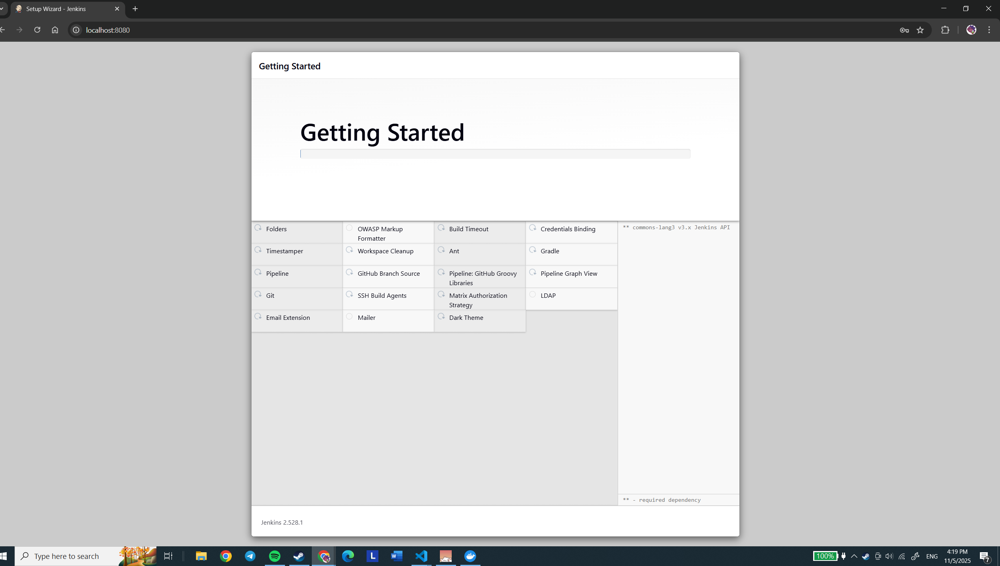
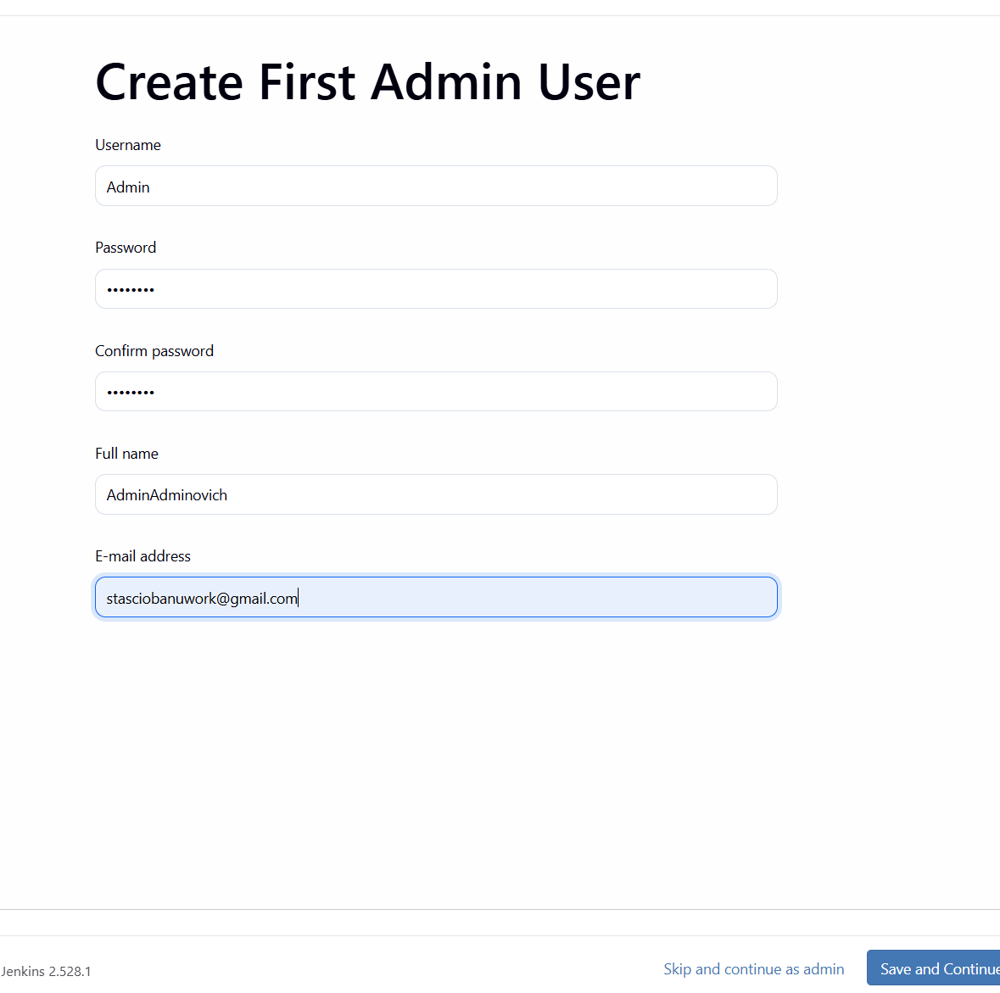
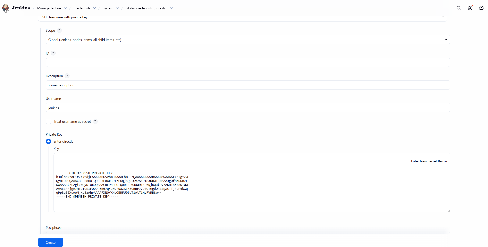
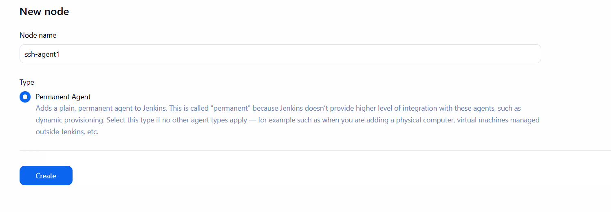
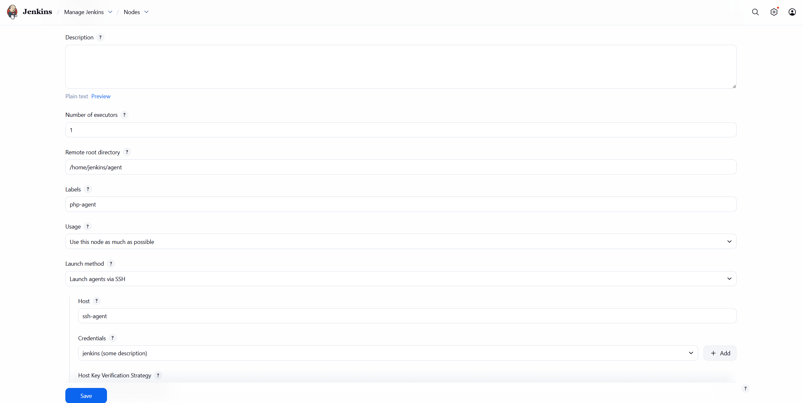
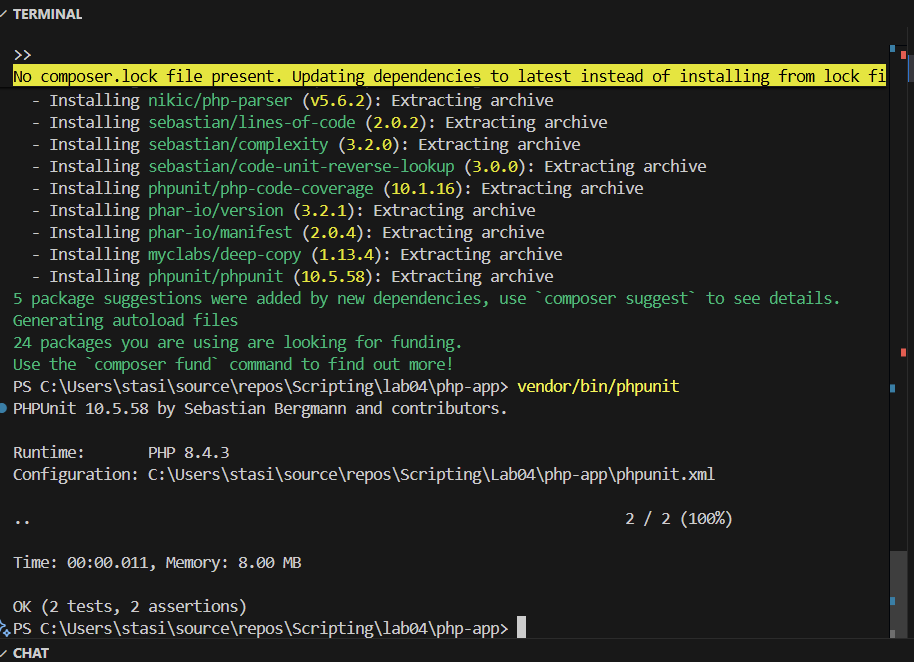

# Lab 4

## Project description

a description here

## Setting up Jenkins Controller

Creating docker-compsoe.yaml
```yaml
services:
  jenkins-controller:
    image: jenkins/jenkins:lts
    container_name: jenkins-controller
    ports:
      - "8080:8080"
      - "50000:50000"
    volumes:
      - jenkins_home:/var/jenkins_home
    networks:
      - jenkins-network

volumes:
  jenkins_home:
  jenkins_agent_volume:

networks:
  jenkins-network:
    driver: bridge
```

## Setting up SSH agent

Createing ssh key with ```ssh-keygen -f jenkins_agent_ssh_key```

Creating dockerfile for ssh-agent
```dockerfile
FROM jenkins/ssh-agent

RUN apt-get update && apt-get install -y php-cli
```

And adding ssh-agent to docker compose

```yaml
...

ssh-agent:
    build:
      context: .
      dockerfile: Dockerfile
    container_name: ssh-agent
    environment:
      - JENKINS_AGENT_SSH_PUBKEY=${JENKINS_AGENT_SSH_PUBKEY}
    volumes:
      - jenkins_agent_volume:/home/jenkins/agent
    depends_on:
      - jenkins-controller
    networks:
      - jenkins-network
```

Creating .env with JENKINS_AGENT_SSH_PUBKEY=<generated public key here>

And starting containers via ```docker-compose up```

Unlocking jenkins with code, logged in container



Setting up admin



Addign SSH key 



Configuring Node





## Creating Jenkins pipeline

Firstly lets ask AI to create a simple php app with unit tests




## Questions